## Hi there 👋 
I'm Sakir Mansuri, a **Data Enthusiast** with a Master's degree in Applied Mathematics.  

🔹 **Automating data workflows** | 🔹 **Transforming raw data into insights**  

### 🛠️ Tech Stack 

### 🌟 Featured Projects  
  
  
  

### 📫 Reach Me  

  

*"From Theory to Data-Driven Reality"*  

### 📜 My Certificates

<!-- Row 1 -->

<a href="certificates/jot_cert_page1.jpg" target="_blank">
  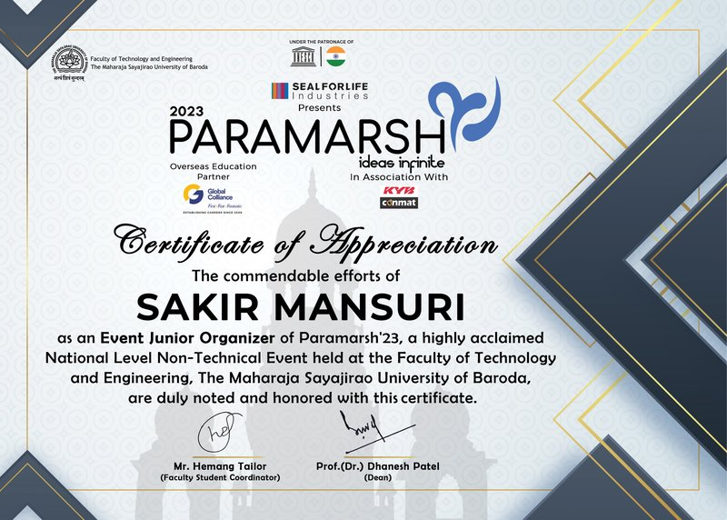
</a>
<a href="certificates/science_camp1_cert_page1.jpg" target="_blank">
  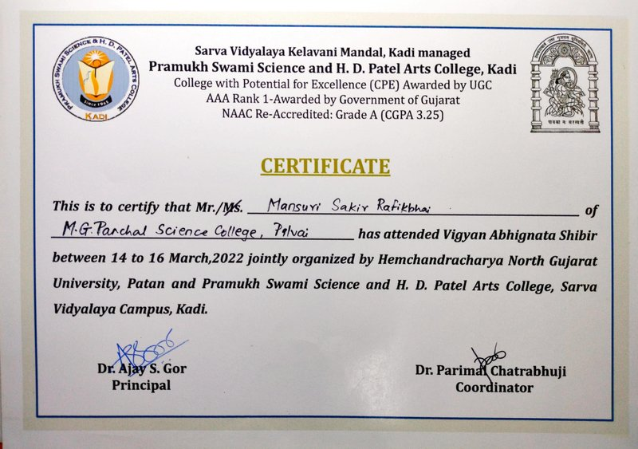
</a>
<a href="certificates/science_camp2_cert_page1.jpg" target="_blank">
  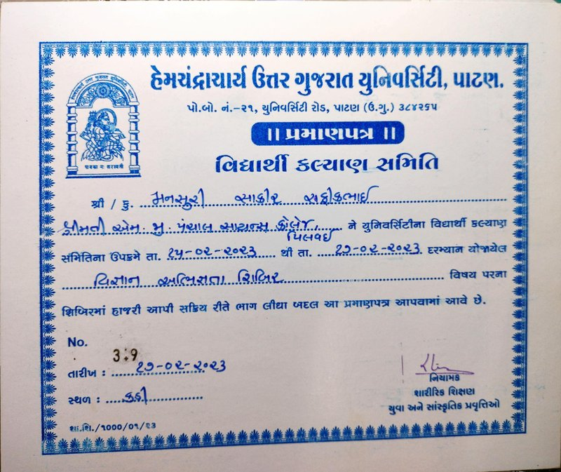
</a>

 

<!-- Row 2 -->
<a href="certificates/delloite_forage_cert.jpg" target="_blank">
  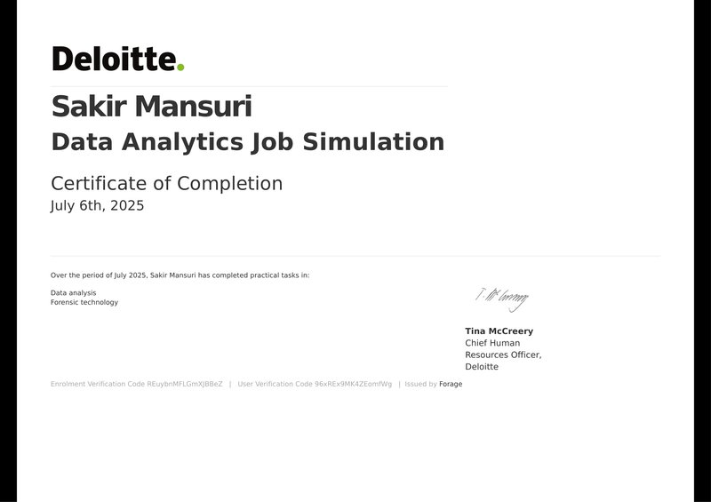
</a>
<a href="certificates/cwb_forage_cert.jpg" target="_blank">
  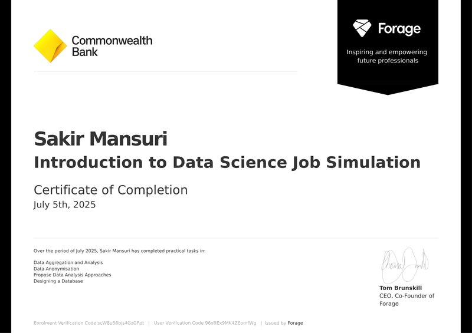
</a>

 

<!-- Row 3 -->
<a href="certificates/dissertation_cert1_page1.jpg" target="_blank">
  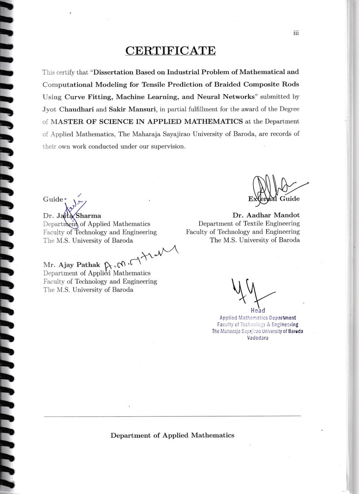
</a>
<a href="certificates/dissertation_cert2_page1.jpg" target="_blank">
  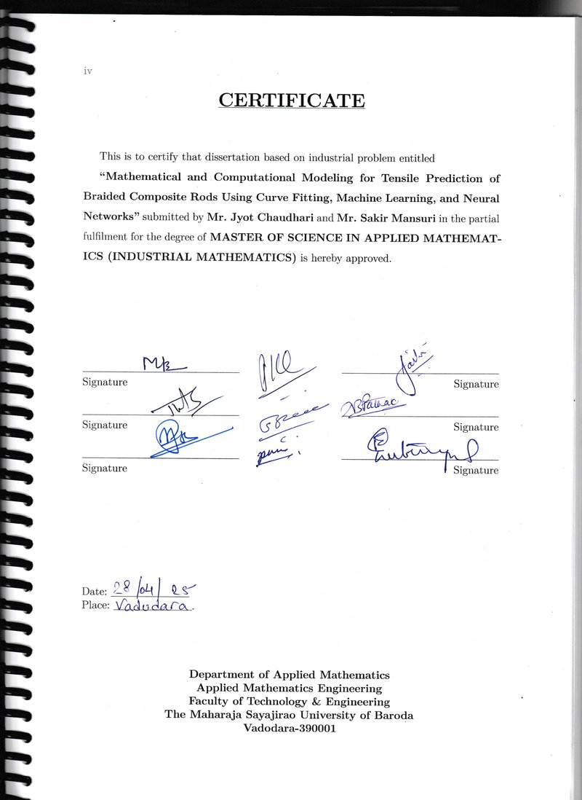
</a>
 

<!-- Row 4 -->
<a href="certificates/python2_gfg_cert.jpg" target="_blank">
  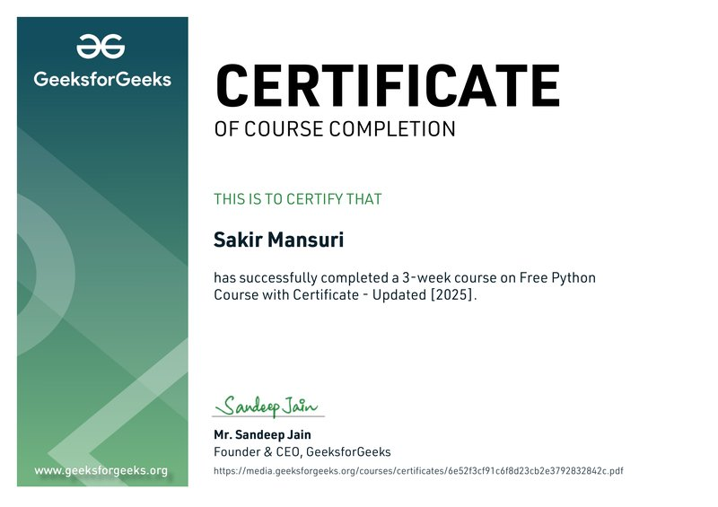
</a>
<a href="certificates/quantinm_forage_cert.jpg" target="_blank">
  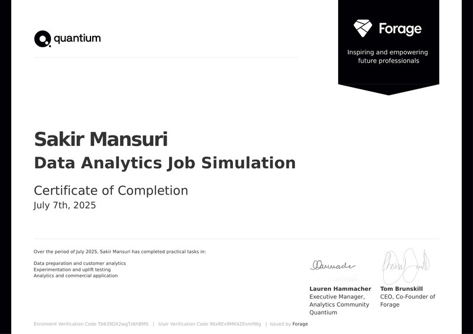
</a>
<a href="certificates/excel3_udemy_cert.jpg" target="_blank">
  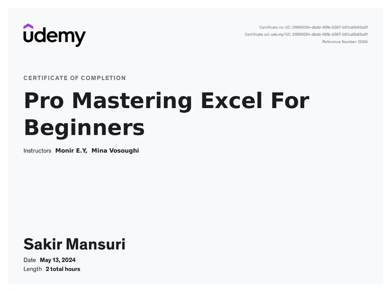
</a>

<a href="certificates/mysql_udemy_cert.jpg" target="_blank">
  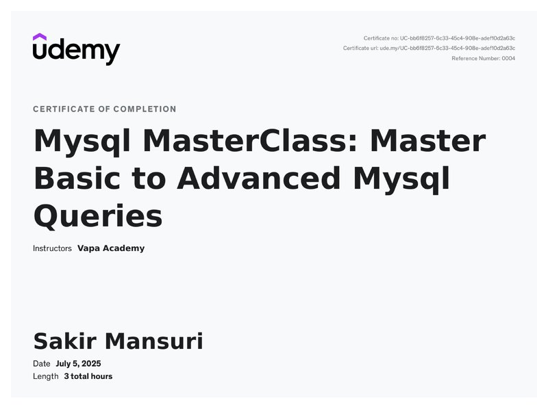
</a>

 

<!-- Row 5 -->

<a href="certificates/sql1_udemy_cert.jpg" target="_blank">
  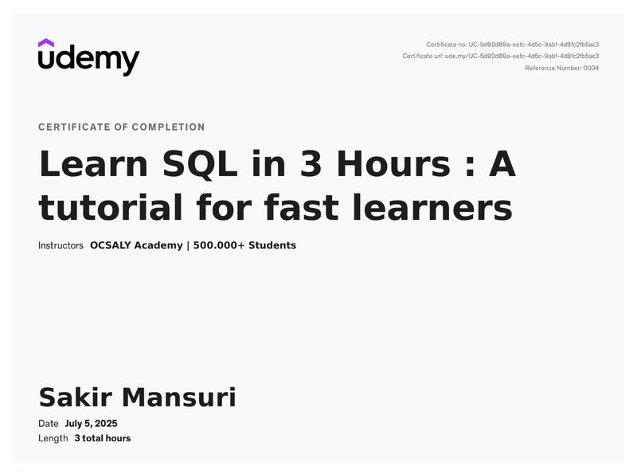
</a>

<a href="certificates/sql3_udemy_cert.jpg" target="_blank">
  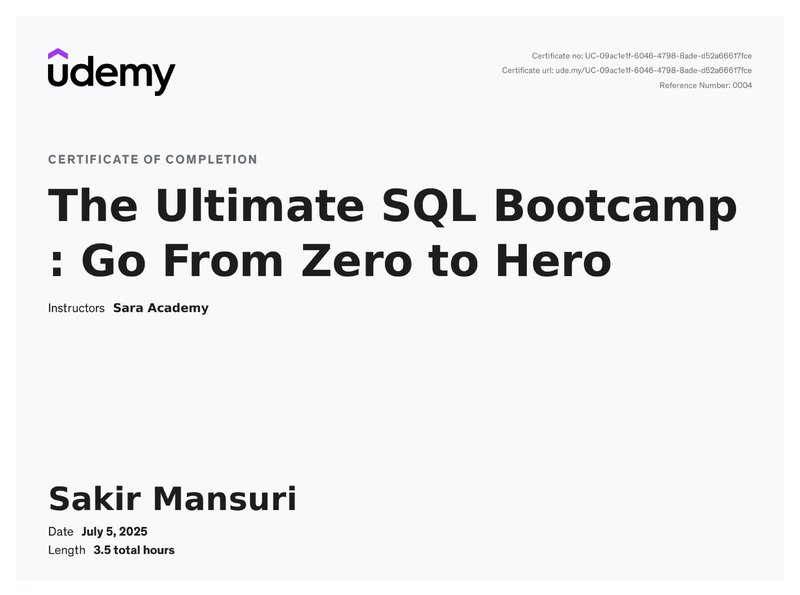
</a>

 
<a href="certificates/tata_forage_cert.jpg" target="_blank">
  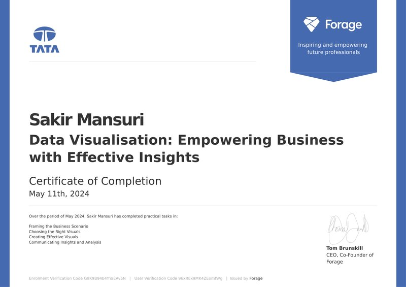
</a>

<a href="certificates/python1_gfg_cert.jpg" target="_blank">
  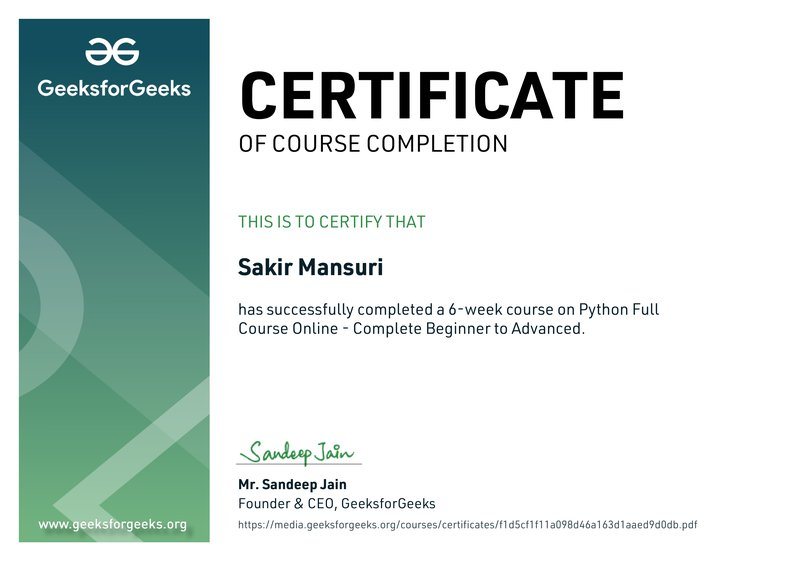
</a>

<!-- Row 6 -->

