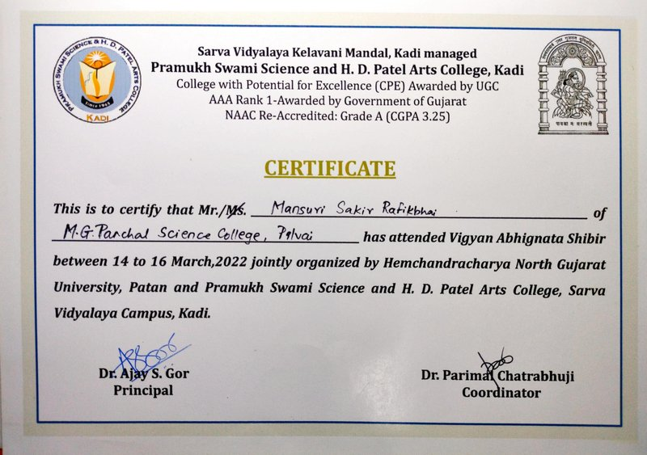
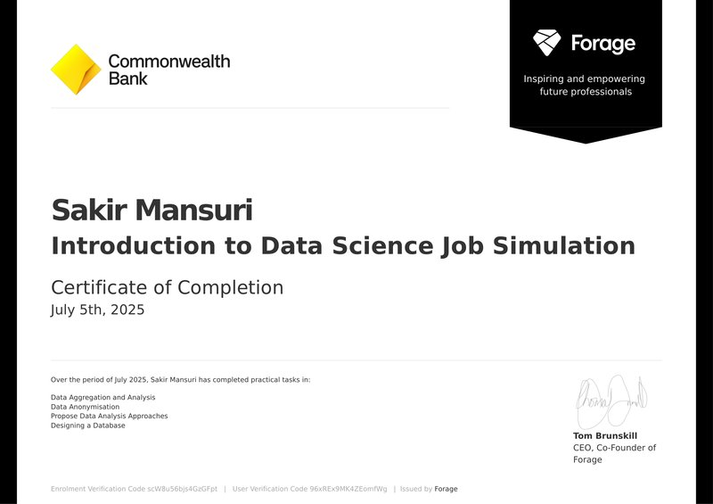
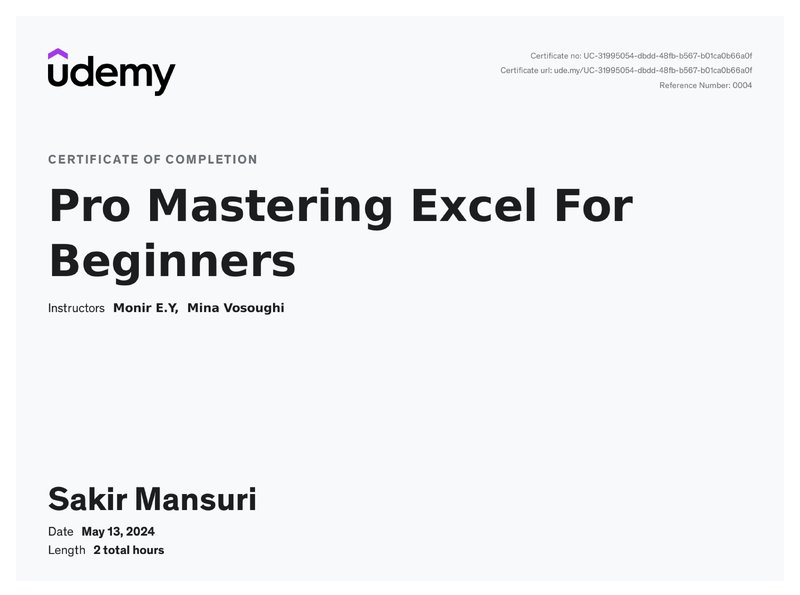
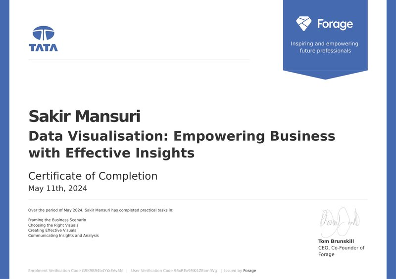
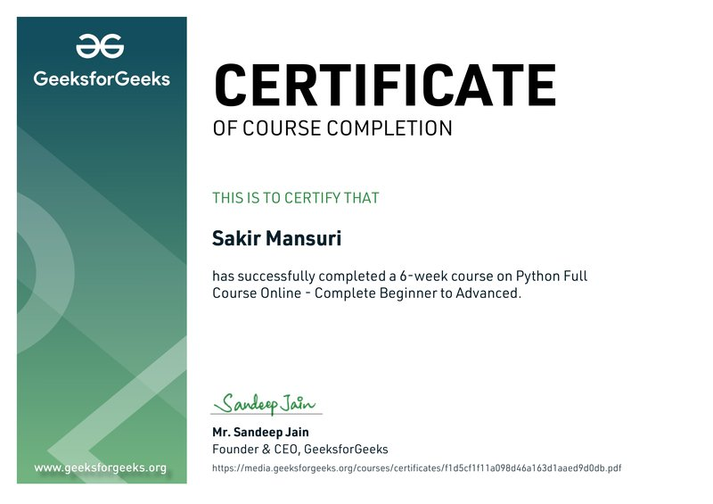

## 👋 Hi, I'm Sakir Mansuri  
** Data Analysis / Data Science & AI Trainer | Applied Mathematics PostGrad**

🎓 Master's in *Applied Mathematics*  
💡 Passionate about *transforming learners into data professionals*  
📊 I teach — *Data Analysis, Data Science, Machine Learning, SQL, Python, Power BI, and Excel*  
### 📫 Reach Me  

 

---

### 🧭 What I Do
- 🧠 Simplify complex data science concepts for real-world understanding  
- 🎓 Train students and professionals in **Data Analytics & ML**  
- 📚 Create structured **notes, exercises, and real-world case studies**  
- 🤖 Guide learners to build **AI & ML projects** from scratch  
- 🧾 Help with **interview preparation & portfolio building**  

---

### 🧠 Learning Resources & Notes  
📘 Explore my **Data Science Learning Series** repositories:  

| Topic | Repository | Description |
|-------|-------------|-------------|
| 🧩 Python for Data Science | [Python_Basics_For_Data](https://github.com/sakirmansuri/Python_Basics_For_Data) | Core Python, NumPy, Pandas, Matplotlib |
| 🗄️ SQL for Analysts | [SQL_Masterclass](https://github.com/sakirmansuri/SQL_Masterclass) | Queries, Joins, Subqueries, Case Studies |
| 📈 Statistics & Hypothesis Testing | [Statistics_Notes](https://github.com/sakirmansuri/Statistics_Notes) | Probability, Sampling, Z/T/ANOVA Tests |
| 🤖 Machine Learning Essentials | [ML_Fundamentals](https://github.com/sakirmansuri/ML_Fundamentals) | Algorithms, Model Evaluation, Projects |
| 📊 Excel & Power BI | [Excel_PowerBI_Practice](https://github.com/sakirmansuri/Excel_PowerBI_Practice) | Data Cleaning, Dashboards, Insights |

> 💬 All notes are designed for learners who want **clarity + hands-on practice**.

*"From Theory to Data-Driven Reality"*  

⭐ **Follow for free notes, case studies & data projects**
---

### 🛠️ Tech Stack

---

### 💼 Featured Projects

---

### 📜 My Certificates

<!-- Row 1 -->

 

<!-- Row 2 -->

 

<!-- Row 3 -->

 

<!-- Row 4 -->

 

<!-- Row 5 -->

 

---
 

