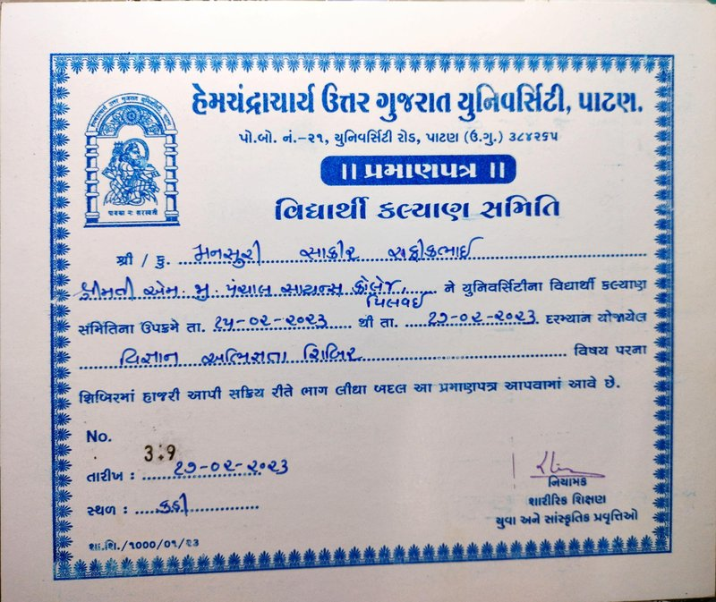
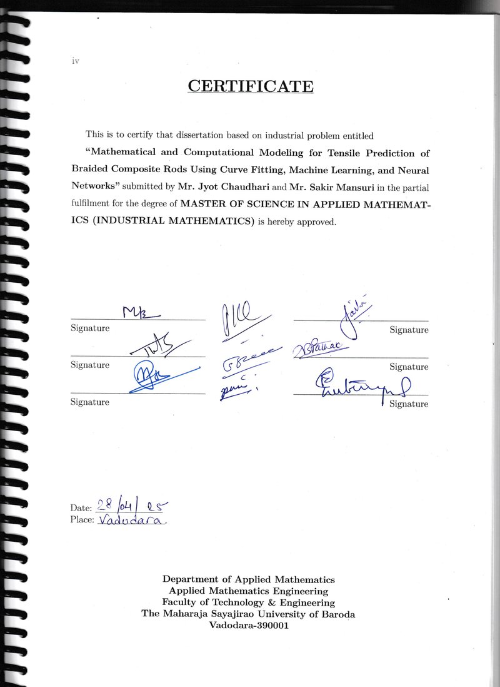
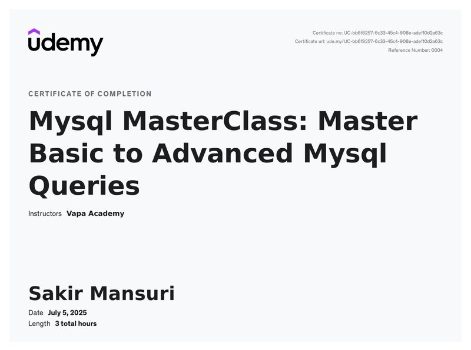
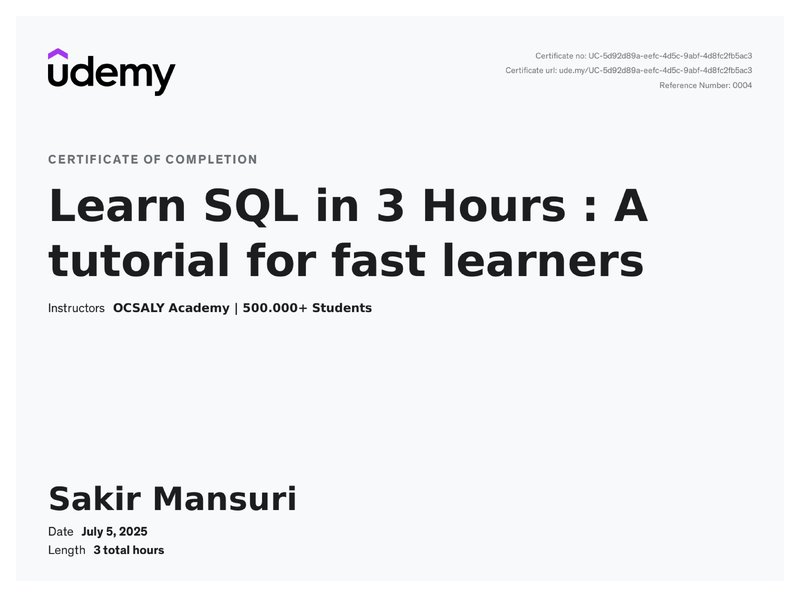

<h1 align="center">👋 Hi, I'm Sakir</h1>
<h3 align="center">Data Analysis • Data Science & AI Trainer | Applied Mathematics Post-Graduate</h3>

 
  

<h2> About Me</h2>
🌟 I enjoy teaching and learning.

🎓 Post-Graduate in Applied Mathematics with Specialization in Industrial Mathematics

🧠 Trainer for Data Analysis, Data Science, Machine Learning, AI

📚 I simplify complex topics for students & working professionals

🧩 I create notes, exercises, case studies & projects

🎯 Transform learners into job-ready data professionals

🔗 Connect With Me

    

🧭 What I Teach
✔ Python for Data
✔ SQL (MySQL & PostgreSQL)
✔ Statistics & Hypothesis Testing
✔ Machine Learning
✔ Excel 
✔ Power BI & Tableu
✔ Data Cleaning, Visualization & Storytelling
✔ Interview Preparation & Portfolio Guidance

📚 Learning Resources & Notes (Repositories)
Topic	Repository	Description

🐍 Python	Python_Basics_For_Data
	Python Basics, Numpy, Pandas, Visualization

🗄 SQL	SQL_Masterclass
	Basic to Advanced SQL, Joins, Case Studies

📊 Statistics	Statistics_Notes
	Probability, Sampling, Z/T/ANOVA Tests

🤖 Machine Learning	ML_Fundamentals
	Algorithms, EDA, Metrics, Hands-On

📈 Excel & BI	Excel_PowerBI_Practice
	Dashboards, Data Cleaning, DAX

⭐ Notes designed for clarity & practical learning.

🛠️ Tech Stack

         

###🚀 Featured Projects

  
  
  

###🏆 Certificates

 <!-- Row 1 -->       <!-- Row 2 -->       <!-- Row 3 -->     <!-- Row 4 -->       <!-- Row 5 -->          

